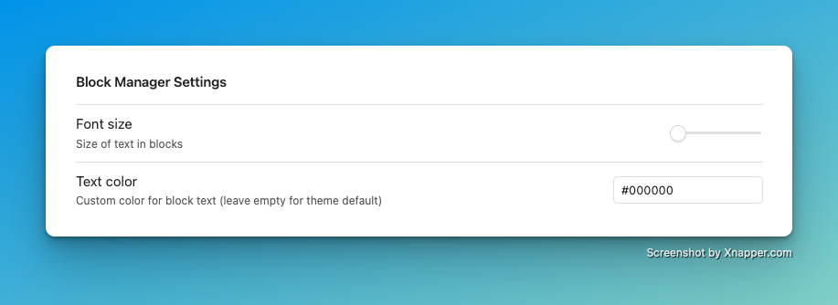
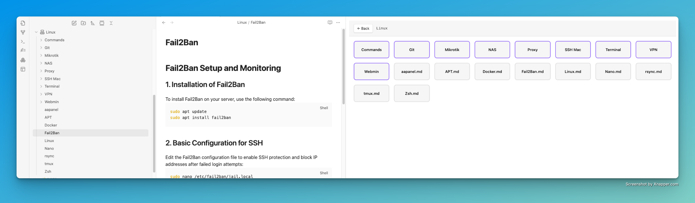
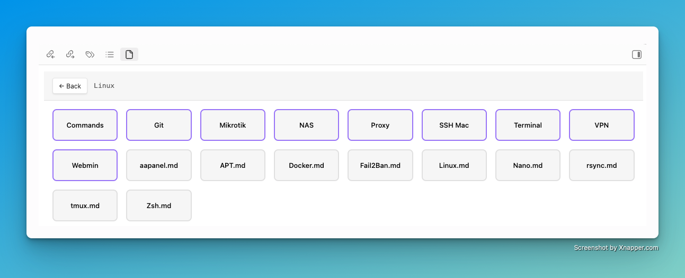

# Block Manager – Obsidian Plugin

A block-based file manager for Obsidian with grid layout, drag-and-drop operations, and intuitive folder navigation. Browse your vault like a visual file explorer with blocks representing folders and markdown files.





## Features

- **Grid Layout**: Clean, responsive block-based view of your vault
- **Folder Navigation**: Click folders to browse, back button to navigate up
- **Drag & Drop**: Move files and folders by dragging them into other folders
- **Context Menu**: Right-click for open, rename, delete, and reveal options
- **Markdown Focus**: Shows only folders and `.md` files for a clutter-free experience
- **Customizable**: Adjustable block size, grid spacing, and sorting options
- **Responsive Design**: Adapts to different screen sizes

## Installation

1. Copy this plugin folder to your vault's `.obsidian/plugins/` directory
2. Build the plugin (requires Node.js and npm):
   ```bash
   npm install
   npm run build
   ```
3. Enable the plugin in Obsidian Settings → Community plugins

## Usage

- **Open**: Use ribbon icon or Command Palette → "Open Block Manager View"
- **Navigate**: Click folder blocks to enter, use back button to go up
- **Move Files**: Drag file/folder blocks onto folder blocks to move them
- **File Operations**: Right-click blocks for context menu with open, rename, delete options
- **Settings**: Customize in Settings → Block Manager

## Settings

- **Font Size**: Customize text size in blocks
- **Text Color**: Set custom color for block text (leave empty for theme default)

## Development

- **Development Mode**: `npm run dev` (watch and rebuild)
- **Build**: `npm run build`
- **Lint**: `npm run lint`

## Key Differences from Canvas

- **Fixed Grid Layout**: Organized blocks instead of freeform canvas
- **Folder-based Navigation**: Hierarchical browsing like traditional file managers  
- **Markdown Focus**: Only shows folders and `.md` files
- **Compact Design**: No icons, text-only blocks for maximum information density

## License

MIT